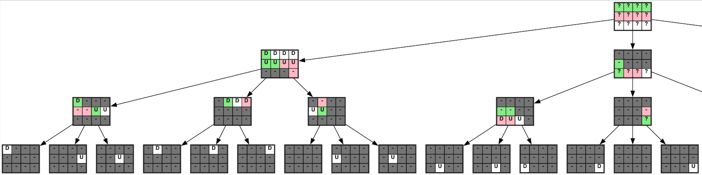

# Weighing twelve marbles

The problem:

```
You have 12 marbles, which all have the same weight except one, which 
may be either heavier or lighter.  How can you find the different one
in three weighings on a balance scale?
```

I found a solution and wanted to visualize it.  After cobbling together
a bunch of tools, I was able to do so:

 - a Haskell program (`makesvg`) converts a simple text representation of the state into an svg image
 - a Graphviz file describes the structure of the tree
 - the nodes in the right have are symmetric, and produced by a shell script (`symmetry.sh`)

The visualization of the nodes uses these symbols:

 - `?` - a marble about which we have no information
 - `D` - ("down") a marble that has been on the heavier side of a weighing
 - `U` - ("up") a marble that has been on the lighter side of a weighing
 - `-` - a marble that is known to not be different
 - green - a marble placed on the left side of the scale at the next weighing
 - pink - a marble placed on the right side at the next weighing

In the tree, the left branch is the left side (green) being heavier, the right branch is the right
side (pink) being heavier, and the middle is the weights being equal.

The [full image](tree.png) is pretty wide.  Here's the left half:



After doing all this, I found the [same solution described on the "puzzling" stackechange](https://puzzling.stackexchange.com/questions/183/twelve-balls-and-a-scale).
The same entry also has a better solution where the sequence of weighings does not depend on the results of weighings.  Much more elagant.
